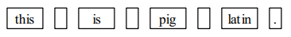

# Pig Latin

<div class="toc"></div>

本节通过一个简化的 C 程序复习模块化开发和逐步求精的过程。**模块化开发**就是把一个程序分成多个模块的技术，回忆下 CS101 作业 1 中 `soundex` 的处理过程，模块通过一系列函数实现功能拆分。

通过该案例，我们也可以了解从 C++ 转到 C 的一些变化，例如，如何维护状态信息？如何保持状态的私有性？

## 任务说明

Pig Latin 按照如下规则转换每个英文单词，从而创造一门新的语言：

- 如果单词以辅音开头，则将第一个元音字母前的所有辅音字符串移到末尾，并加上 `ay`
- 如果单词以元音开头，则加上 `way`

例如，单词 `scram` 符合第一条规则，所以将 `scr` 移动到尾部并加上 `ay`，结果就是 `amscray`。单词 `apple` 符合第二条规则，所以直接加上 `way`，结果就是 `appleway`。

## 任务 1：实现交互程序

程序执行时会提示用户输入一段文字，然后输出如下结果：

```
Enter a line: this is pig latin.
isthay isway igpay atinlay.
```

我们采用自顶向下实现，可以不用一开始就决定如何将程序分割成多个模块。在实现交互程序时，可以先假设有一个接口，能够将一行字符串转换成 Pig Latin：

```c
/*
 * Function: TranslateLine
 * Usage: TranslateLine(line);
 * ---------------------------
 * This function takes a line of text and translates
 * the words in the line to Pig Latin, displaying the
 * translation as it goes.
 */

void TranslateLine(string line);
```

以抽象思维开发程序，我们已经能够实现程序的交互部分了。

<details>
  <summary>💡Hint</summary>
  
  ```c
  int main(int argc, string args[]) {
    printf("Enter a line: ");
    string line = GetLine();
    TranslateLine(line);
  }
  ```
</details>

## 任务 2：实现 TranslateLine

实现 TranslateLine 将转变抽象层级，此时我们作为开发者将提供上述接口。在这个层级上，问题依然复杂，需要进一步将问题拆解。

TranslateLine 需要做的工作大致可以分为 3 步：

- 如何将一个字符串拆分成独立的单词
- 按规则将每个单词转换成 Pig Latin
- 显示转换后的单词，并以换行符结尾

<details>
  <summary>💡Hint</summary>
  
  ---

  如果以容器的思想，如何拆分上述步骤？

  C 虽然没有提供直接使用的容器，但使用动态数组，我们也能够完成同样的任务。这里为了简便起见，我们不需要存储每个单词，一旦翻译完成就立刻显示结果，并处理下一个单词。

  ---

</details>

回顾 CS101 中作业 2 的 `search` 程序，对单词的处理一般是通过 `token` 来完成的。比如，这样的输入行：

> this is pig latin.

可以看作是以下 8 个 `token` 组成：



可以看出，除了单词，`token` 还包括一些标点组成的字符，在处理 `token` 时需要进行判断。这里我们假设有一个谓词函数接口 `IsLegalWord` 可以直接使用。

同样为了简便起见，我们提供了一份 C 版本的 `tokenscanner` 接口库。

| 函数                | 功能                                     |
| ------------------- | ---------------------------------------- |
| `InitScanner(line)` | 初始化扫描器，以便从开头读取每个 `token` |
| `GetNextToken()`    | 返回下一个 `token`                       |
| `AtEndOfLine()`     | 如果扫描器到达末尾，返回 `true`          |

常用的编程习语可以参考如下的循环结构。其中，`InitScanner` 初始化后，`GetNextToken` 将能够获取第一个记号。如果还没有 `AtEndOfLine`，扫描器将会继续获取下一个记号。

```c
InitScanner(line);
while (!AtEndOfLine()) {
   token = GetNextToken();
   ... 处理 token 记号 ...
}
```

在 `tokenscanner` 的帮助下，我们进一步拆分了 `TranslateLine` 处理逻辑，将翻译的工作交给 `TranslateWord` 处理。

<details>
  <summary>💡Hint</summary>
  
  ```c
void TranslateLine(string line) {
    InitScanner(line);
    while (!AtEndOfLine()) {
        string token = GetNextToken();
        if (IsLegalWord(token))
            token = TranslateWord(token);
        printf("%s", token);
    }
    printf("\n");
}
  ```
</details>

## 任务 3：实现 IsLegalWord 和 TranslateWord

完成 `TranslateLine` 的拆解后，我们的工作只剩下 `token` 处理的几个函数。

`IsLegalWord` 相对比较容易，我们只需要借助 `ctype.h` 接口提供的 [`isalpha`](https://en.cppreference.com/w/c/string/byte/isalpha) 函数就能够判断 `token` 是否为有效单词。

<details>
  <summary>💡Hint</summary>
  
  ```c
bool IsLegalWord(string token) {
    for (int i = 0; i < StringLength(token); i++) {
        if (!isalpha(IthChar(token, i)))
            return (false);
    }
    return (true);
}
  ```
</details>

`TranslateWord` 稍微复杂一些，根据规则你需要判断第一个元音字母的位置：如果位置为 0，则按照规则 1 处理；如果不为 0，则按照规则 2 处理。

那么如何判断元音字母呢？检查 `strlib.h` 接口，我们并没有发现现成的函数可以使用。此时，扩充该接口就很有必要了，因为判断元音的操作相当常见。

剩下的实现相对比较容易，合理使用 `strlib.h` 接口，我们可以完成这个任务。

<details>
  <summary>💡Hint</summary>
  
  ```c
string TranslateWord(string word) {
    int vp = FindFirstVowel(word);
    if (vp == -1) {
        return (word);
    } else if (vp == 0) {
        return (ConcatString(word, "way"));
    } else {
        string head = SubString(word, 0, vp - 1);
        string tail = SubString(word, vp, StringLength(word) - 1);
        return (ConcatString(tail, ConcatString(head, "ay")));
    }
}

int FindFirstVowel(string word) {
    for (int i = 0; i < StringLength(word); i++) {
        if (IsVowel(IthChar(word, i)))
            return (i);
    }
    return (-1);
}
  ```
</details>

## 思考

1. 为什么 `GetNextToken` 不需要提供 `line` 参数？
2. 循环结构中，`GetNextToken` 每次调用，都会从 `line` 的不同位置开始，这是如何做到的？
3. 如何避免外部程序调用我们拆分的这些辅助函数？

## 推荐阅读

更多 C 和 C++ 的不同之处，可以参考 [http://www.cs.ecu.edu/karl/4627/spr18/C.html](http://www.cs.ecu.edu/karl/4627/spr18/C.html)
