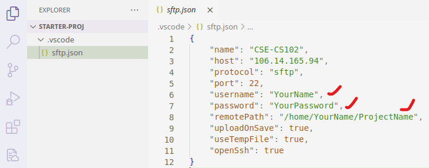
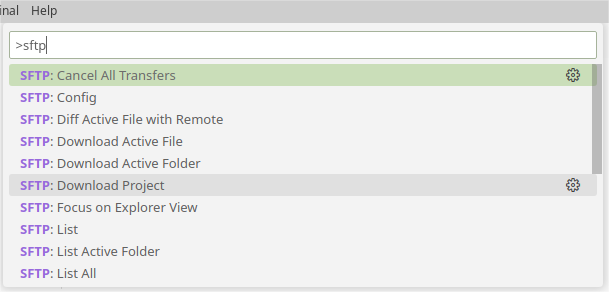

# 实验 0：上手 Linux 开发环境

本课程开发环境选用远程 Linux 云端服务器和命令行工具，搭配本地终端和 VS Code 即可完成所有练习。

本次实验将带大家练习远程开发的流程，实验结束后，你应该能够连接上课程的远程服务器，并能够使用终端命令，搭配 VS Code 进行代码编辑。

>**❓FAQ** 为什么使用远程服务器进行开发？
>
>如果回到上个世纪 80 年代，即使电脑就在你的面前，你也必须使用终端才能对计算机进行操作。现如今，随着个人计算机的发展，虽然图形界面早已成熟，但在真实的开发场景中，使用终端开发仍然占据主导地位。大量的前后端框架、开源项目、开发工具，也严重依赖终端操作。
>
>本课程尽量还原类似的真实开发场景。当你以后有机会去软件公司实习时，你会发现，在这里掌握的技能，将会给你带来极大的回报。

## 登录课程云服务器

服务器 IP 地址为 `106.14.165.94`，在任何支持 `ssh` 命令的**计算机终端**[^1]上输入如下命令。

- Window 11 已搭载 Windows Terminal
- Linux/macOS 内置 Terminal

```
ssh YourName@106.14.165.94
```

第一次使用会弹出确认信息，输入 `yes` 后紧接着输入服务器用户密码（输入过程中，密码不会显示），成功后的输出信息如下。

```
The authenticity of host '106.14.165.94 (106.14.165.94)' can't be established.
ED25519 key fingerprint is SHA256:LHvn4qDvTdM1+GcJtG2f+uywxDA2JSys.
This key is not known by any other names
Are you sure you want to continue connecting (yes/no/[fingerprint])? yes

Warning: Permanently added '106.14.165.94' (ED25519) to the list of known hosts.
YourName@106.14.165.94's password:     

Welcome to Ubuntu 22.04.1 LTS (GNU/Linux 5.15.0-52-generic x86_64)
```

查看服务器信息常用命令

- 查看主机名：`hostname`
- 查看用户名：`whoami`
- 查看硬盘空间：`df -h` （仅 `root` 权限）
- 查看内存状态：`free -h`
- 查看当前文件夹空间：`du --max-depth=1 -h`
- 修改登录密码：`passwd`

## 基于 SFTP 远程开发工作流

使用命令行成功登录服务器后，说明你的计算机已经包含了 SSH 等工具。为了便于开发，可以使用流行的 VS Code 文本编辑器辅助编辑、同步项目代码。

>**❓FAQ** 为什么本课程不推荐使用 VS Code 官方 Remote 插件？
>
>如果使用官方 Remote 插件，一旦连接服务器，VS Code 会在 `home` 目录不断生成 `.vscode-server` 垃圾文件，严重的时候甚至达到几个 GB 的空间。
>
>除此之外，官方 Remote 插件内存占用也比较高，每个用户都会消耗几百 MB 的内存资源。
>
>如此高的资源消耗，即便国内外各大高校自建的校内服务器，也无法承受。
>
>*参考：[Copies of vscode-server installed on school servers take up excessive storage and RAM](https://github.com/microsoft/vscode-remote-release/issues/6429)*

## 安装 SFTP 插件

在 VS Code 插件市场搜索 `SFTP`，选择安装 Natizyskunk 开发的 `SFTP` 插件，如图所示。


## 配置

安装完插件之后，可以使用本课程提供的初始项目 `starter-proj.zip`，该项目已设置好 VS Code 和 `SFTP` 配置框架。解压后使用 VS Code 打开 `starter-proj` 文件夹。在 `.vscode` 文件夹下，编辑 `sftp.json` 文件修改以下几个信息：

- `username`：服务器用户名
- `password`：服务器密码
- `remotePath`：服务器上需要编辑的项目路径，例如 `/home/xuehao/cs102/lab0/`



## 使用

>**⚠️注意**
>
>参照上一步配置的 `remotePath`，必须先在服务器上提前创建好这些目录，才能进行接下来的操作。

配置好后，点击 VS Code 菜单栏 **Help** 选择 **Show All Commands**，或直接按 **F1** 快捷键，在弹出的命令列表中搜索 SFTP。选择 "**SFTP: Download Project**"，随后选择默认保存位置，远程服务器中的项目将会自动下载到本地的初始项目文件夹中。



在本地编辑完文件并保存后，SFTP 插件会自动将更新后的文件同步到远程服务器。编译、测试、调试等任务，可以通过终端 Terminal 在远程服务器上进行。


>**⚠️注意**
>
>**添加文件**：如果之前没有创建任何项目文件，那么当你在本地或服务器中创建文件时，并不会自动同步。此时可以使用 "**SFTP: Sync Remote -> Local**" 或 "**SFTP: Sync Local -> Remote**" 手动同步。
>
>**删除文件**：删除文件比较特殊，以上三条命令，对删除文件不起作用。如果有文件需要删除，必须在本地和服务器中分别手动删除。


>**⚠️注意**
>
>如果不小心使用 VS Code 官方远程插件，可以使用 `ls -a` 命令查看你的服务器目录，此时你会发现一个 `.vscode-server` 文件夹。
>
>可以使用使用 `rm -r .vscode-server` 命令删除该目录。

>**⚠️注意**
>
>严禁使用 Jetbrains Clion/Fleet 连接服务器！一旦连接，此类开发工具会在服务器上下载超过 2 GB 的 Java 依赖。


---

[^1]: [终端](https://wiki.mbalib.com/wiki/%E7%BB%88%E7%AB%AF%EF%BC%88%E8%AE%A1%E7%AE%97%E6%9C%BA%EF%BC%89)是一台电子计算机或者计算机系统，用来让用户输入数据，及显示其计算结果的机器。