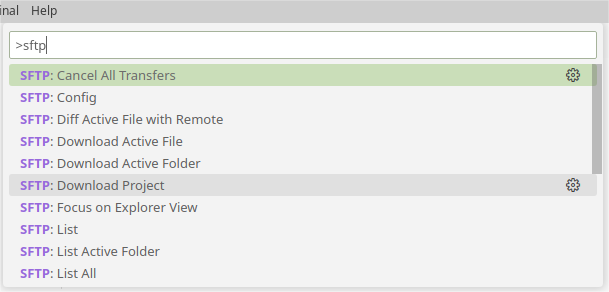

# VS Code 远程开发工作流

使用命令行成功登录服务器后，说明你的计算机已经包含了 SSH 等工具。为了便于开发，可以使用流行的 VS Code 文本编辑器辅助编辑、同步项目代码。

> 以下内容默认你已经成功使用终端，登录过远程服务器。如果还没有尝试过，请返回上一节。

## 安装

前往官网下载安装 [VS Code](https://code.visualstudio.com/)，接下来安装 `SFTP` 插件。在插件市场搜索 `SFTP`，选择安装 Natizyskunk 开发的 `SFTP` 插件，如图所示。

## 配置

安装完插件之后，可以使用本课程提供的初始项目 `starter-proj.zip`，该项目已设置好 VS Code 和 `SFTP` 配置框架。解压后使用 VS Code 打开 `starter-proj` 文件夹。在 `.vscode` 文件夹下，编辑 `sftp.json` 文件修改以下几个信息：

- `username`：服务器用户名
- `password`：服务器密码
- `remotePath`：服务器上需要编辑的项目路径，例如 `/home/xuehao/cs102/lab0/`

## 使用

>**⚠️注意**
>
>参照上一步配置的 `remotePath`，必须先在服务器上提前创建好这些目录，才能进行接下来的操作。

配置好后，点击 VS Code 菜单栏 **Help** 选择 **Show All Commands**，或直接按 **F1** 快捷键，在弹出的命令列表中搜索 SFTP。选择 "**SFTP: Download Project**"，随后选择默认保存位置，远程服务器中的项目将会自动下载到本地的初始项目文件夹中。

在本地编辑完文件并保存后，SFTP 插件会自动将更新后的文件同步到远程服务器。编译、测试、调试等任务，可以通过终端 Terminal 在远程服务器上进行。

>**⚠️注意**
>
>**添加文件**：如果之前没有创建任何项目文件，那么当你在本地或服务器中创建文件时，并不会自动同步。此时可以使用 "**SFTP: Sync Remote -> Local**" 或 "**SFTP: Sync Local -> Remote**" 手动同步。
>
>**删除文件**：删除文件比较特殊，以上三条命令，对删除文件不起作用。如果有文件需要删除，必须在本地和服务器中分别手动删除。