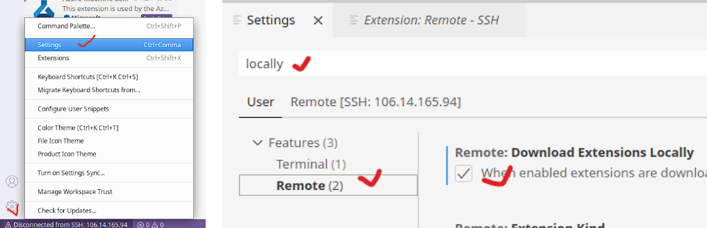
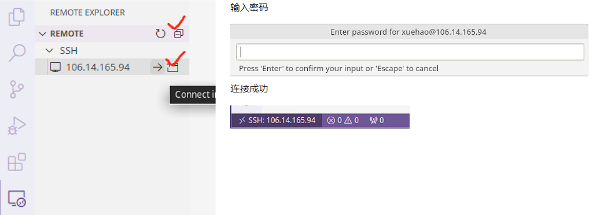

# VS Code 官方远程插件（仅供了解）

>**❓FAQ** 为什么本课程不推荐使用 VS Code 官方 Remote 插件？
>
>如果使用官方 Remote 插件，一旦连接服务器，VS Code 会在 `home` 目录不断生成 `.vscode-server` 垃圾文件，严重的时候甚至达到几个 GB 的空间。
>
>除此之外，官方 Remote 插件内存占用也比较高，每个用户都会消耗几百 MB 的内存资源。
>
>如此高的资源消耗，即便国内外各大高校自建的校内服务器，也无法承受。
>
>*参考：[Copies of vscode-server installed on school servers take up excessive storage and RAM](https://github.com/microsoft/vscode-remote-release/issues/6429)*

在插件市场搜索并安装 **Remote - SSH** 插件——可以看出该插件至今仍然是 Preview 状态，尚未稳定。


插件安装完成后，点击设置，输入 “**locally**”，在 Remote 插件配置中，勾选 “**Remote: Download Extensions Locally**”。



配置完插件后，在工具栏选择 Remote Explorer，点击 SSH 后面的 **`+`** 号。在弹出的输入窗口中，输入

```
ssh YourName@106.14.165.94
```

随后会提示选择配置文件保存位置，此处直接“回车”选择默认位置即可。


此时点击 Remote 右侧的刷新按钮，就可以看到服务器 IP。连接该服务器，只需要点击 IP 右侧的箭头，随后输入你的账户密码就可以登录。登录成功后，可以在 VS Code 右下角看到连接状态。



服务器连接成功后，通过 VS Code 菜单栏 **File** 可以选择 “**Open File/Open Folder**” 编辑你的文件或项目。

>**⚠️注意**
>
>以上练习完成后，可以使用 `ls -a` 命令查看 home 目录，此时你会发现一个 `.vscode-server` 文件夹。
>
>结束练习后，关闭 VS Code，然后使用 `rm -r .vscode-server` 命令删除 `.vscode-server` 文件夹。

>**⚠️注意**
>
>严禁使用 Jetbrains Clion/Fleet 连接服务器！一旦连接，此类开发工具会在服务器上下载超过 2 GB 的 Java 依赖。