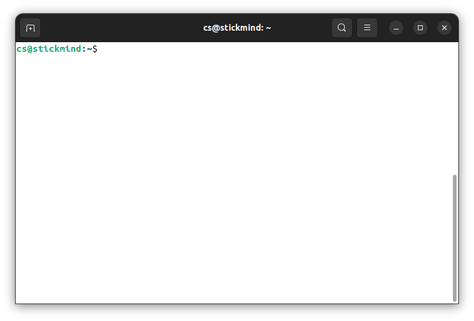

# Linux 命令行

<div class="toc"></div>

Linux 发行版通常提供多种不同的图形桌面环境，极大地方便了不同用户的使用习惯，但是 Linux 系统真正强大的却是命令行。本课程建议大家选择一款流行的桌面环境，将更多的精力放在命令行的学习上，而不是放在五花八门的桌面环境定制上。

从今天开始，通过命令行工具和你的 Linux 系统进行交互，并一直走下去。真正的 Linux 系统管理员也是花费了大量的时间在命令行的工具上，通过文本界面自动化一些任务，解决一些问题。有句话是这么说的，“图形用户界面让简单的事情变得更简单，而命令行界面让困难的任务变得可能”。Linux 系统严重依赖大量的命令行工具，这些工具有以下一些优点：

- 没有 GUI 开销，对硬件要求更友好
- 几乎所有的任务都能够通过命令行完成
- 可以为一些常见的任务定制命令脚本自动完成
- 可以在任何地方通过网络连接远程 Linux 服务器
- 图形界面在不同的发行版中会有差异，但命令行的使用却是通用的

## 使用文本终端

终端模拟器程序在桌面窗口中模拟独立终端，本质上就像你在没有运行图形界面的纯文本终端上登录机器一样。大多数终端模拟器程序支持打开多个终端会话。Ubuntu 默认使用 `gnome-terminal` 终端应用程序。



## sudo

`sudo` 为用户提供管理（admin）权限，允许用户使用 `root` 用户的安全权限来运行程序。全新安装的 Ubuntu 系统默认 `root` 密码是随机的，每次开机都会有一个新的密码。

如果想把该密码固定，可以打开终端，输入以下命令。重复输入两次密码进行设置（输入过程中，字符不会显示）。

```
sudo passwd
```

此时我们可以通过以下命令切换到 `root` 用户。注意，在 `root` 用户下所有操作都是允许的，切记不要误改文件，否则无法恢复。

```
su root
```

```
cs@stickmind:~$ su root
Password: 
root@stickmind:/home/cs# 
```
