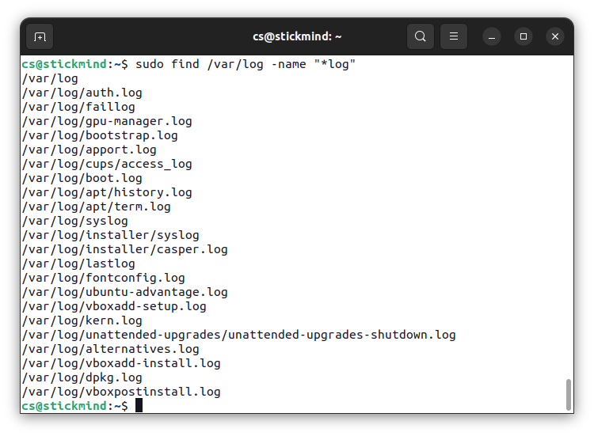

# 文件搜索

<div class="toc"></div>

熟练使用查找命令可以节省很多时间并提高工作效率，涉及搜索的主要工具是 `find` 等实用程序。

## 标准文件流

在执行命令时，默认情况下有三个标准文件流始终打开以供使用：标准输入 **`stdin`**、标准输出 **` stdout`** 和标准错误   **`stderr`**。

| 名称     | 符号名       | 值  | 示例 |
| -------- | ------------ | --- | ---- |
| 标准输入 | **`stdin`**  | 0   | 键盘 |
| 标准输出 | **`stdout`** | 1   | 终端 |
| 标准错误 | **`stderr`** | 2   | 日志 |

**`stdin`** 通常是键盘，**`stdout`** 和 **`stderr`** 通常打印在终端上。利用重定向，也可以将某个文件作为输入 **`stdin`**，并将输出 **`stdout`** 定向到另一个文件，**`stderr`** 通常定向到错误日志文件。

在 Linux 中，所有打开的文件都由所谓的**文件描述符**（file descriptor）在内部表示的并从零开始，**`stdin`** 是 `0`，**`stdout`** 是 `1`，**`stderr`** 是 `2`。如果还打开了其他文件，则文件描述符继续从 3 开始，并依次增加。

## 重定向

通过 Shell，我们可以重定向三个标准文件流，这样我们就可以从一个文件或另一个命令中获得输入，而不是从键盘获得输入。我们可以将输出和错误写入文件，或者用于为后续命令提供输入。

例如，可以使用 `>` 符号将 `hello` 输出定向到某个文件：

```
./hello > anyfile
```

使用 `<` 符号将某个文件作为输入：

```
cat < hello.c
```

输入输出还可以组合使用：

```
./add < infile > outfile
```

对于 `stderr` 需要明确指定文件描述符的值：

```
./add 2> errfile
```

如果打算将 `stderr` 输出到 `stdout`，则可以使用：

```
./add > outfile 2>&1
```

## 管道

UNIX/Linux 的理念是设计许多简单而简短的程序或命令，协同工作来解决复杂的任务，而不是设计一个复杂的程序，通过不同的选项和模式来完成。为了实现这一点，UNIX/Linux 大量使用**管道**来实现这一目的，通过管道可以将一个命令或程序的输出作为另一个命令或程序的输入。

可以通过管道符号 `|` 来实现管道操作：

```
$ cmd1 | cmd2 | cmd3
```

以上命令非常有效，因为 `cmd2` 和 `cmd3` 不必等待先前的管道命令完成，就可以开始处理其输入流中的数据；特别是在多核心系统上，可用的计算能力得到了更好的利用。

另一点是，管道之间的输入输出无需存储到硬盘上，硬盘的读写同样效率低下。

## 文本搜索

使用 `grep` 命令可以打印与模式匹配的行，常用于查找字符串。例如，在文件 `hello.c` 中查找 `main` 函数，可以使用如下的命令：

```
grep main hello.c
```

利用管道，也可以在标准输出中查找字符串，例如：

```
cat hello.c | grep main
```

## 文件查找

**`find`** 是 Linux 系统管理员日常生活中非常有用且经常使用的实用程序。它可以从任意特定目录（或目录集）向下递归文件系统，并定位符合指定条件的文件，默认路径名始终为当前工作目录。

例如，管理员有时会花几周的时间扫描的一个潜在的核心文件，以便将其删除。有时候也用于清理临时目录 `/tmp` 或缓存目录 `/var/cache/` 中的非必要文件。许多发行版也内置一些脚本程序，定期清理这些目录。



不指定参数的情况下，`find` 会递归列出当前目录下所有的文件。常用的选项有：

- `-name` 列出包含某个字符串的文件

    ```
    find /usr -name gcc
    ```

- `-iname` 列出不包含某个字符串的文件

    ```
    find /usr -iname gcc
    ```

- `-type` 限定文件的类型，例如 `d` 表示目录，`l` 表示符号链接，`f` 表示普通文件


    ```
    find /usr -type d -name gcc
    ```

    ```
    find /usr -type f -name gcc
    ```

`find` 的另一个用途是能够在符合搜索条件的文件上运行命令，需要使用选型 `-exec`。例如，查找并删除 `.swp` 后缀的文件：

```
find -name "*.swp" -exec rm {} ';'
```

其中 `{}` 充当占位符，用于替换搜索到的文件名。需要注意的是，命令必须以 `';'` 或 `\;` 结尾。

## 练习

以 `/` 开头，搜索包含 `init.d` 的文件。

