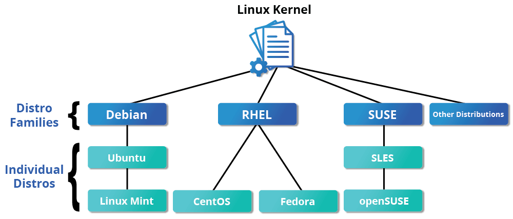

# Linux 介绍

本章通过一些基本概念介绍 Linux 的开发环境。首先，我们会讨论 Linux 基金会；然后，介绍一些流行的 Linux 发行版。最终目的是希望大家能够选择一款合适的发行版，作为日常开发的必备工具。

## Linux 历史

Linux 是一种开源计算机操作系统，最初是在基于英特尔 x86 的个人计算机上开发的。随后，它被移植到了一系列其他硬件平台上，从小型嵌入式设备到世界上最大的超级计算机。

1991 年，Linus Torvalds 还是芬兰赫尔辛基的一名学生。当时他开始了一个项目：编写自己的操作系统**内核**。他还收集并开发了以内核为中心的整个操作系统所需的其他基本组件。没过多久，该项目就被命名为 Linux 内核，并最终发展成为对当今世界产生巨大影响的项目。

1992 年，Linux 通过 **GNU**（自由软件基金会 FSF 的一个项目，推广免费软件）使用 **GPL** 许可，这使它能够建立一个全球开发者社区。通过将内核与 GNU 项目中的其他系统组件相结合，许多其他开发人员创建了名为 **Linux 分发版**的完整系统，该系统首次出现在 90 年代中期。

90 年代中期创建的 Linux 发行版完全免费，为计算提供了基础，并成为开源软件运动的推动力。1998 年，IBM 和 Oracle 等大公司宣布支持 Linux 平台，并开始了一系列重大的开发工作。

## Linux 基金会

Linux 基金会（LF）是一个非营利性技术联盟，负责托管和促进开源软件项目的协作开发。除了提供一个可以保护和加速 Linux 内核开发的中立组织之外，LF 还致力于围绕开源项目构建一个可持续的生态系统，以加速技术开发和商业应用。

Linux 基金会项目对世界基础设施至关重要，包括 Linux、Kubernetes、Node.js、ONAP、PyTorch、RISC-V、SPDX、OpenChain 等。Linux 基金会专注于利用最佳实践，满足贡献者、用户和解决方案提供商的需求，为开放协作创建可持续的模型。

*参见：[linuxfoundation.org](https://www.linuxfoundation.org/)*

## 三大主流 Linux 发行版家族

最具代表性的几个发行版家族有：

- Red Hat 系统家族（包含 CentOS 和 Fedora）
- SUSE 系统家族（包含 openSUSE）
- Debian 系统家族（包含 Ubuntu 和 Linux Mint）

*参见：[The LWN.net Linux Distribution List](https://lwn.net/Distributions/)*

Linux 基金会发布的软件都会保持发行版兼容性，这意味着这些软件几乎可以在所有的现代发行版中无差别运行。不同发行版之间可能仅仅是包管理器、软件版本、文件位置之间有些许差异。掌握任何一个发行版的使用后，都可以很快地迁移到另一个。

## Red Hat 系统家族

Red Hat Enterprise Linux（RHEL）家族包括 Fedora，Rocky Linux 和 Oracle Linux 在内的系列产品。

Fedora 与 RHEL 有着密切的关系，并且包含的软件比 Red Hat 的企业版多得多。其中一个原因是，一个多元化的社区参与了 Fedora 的构建，其中许多贡献者并不为 Red Hat 工作。此外，它还被用作未来 RHEL 版本的测试平台。

由于 CentOS 8 在 2021 年之后不再更新，Rocky Linux 挑起了大梁，目的是提供一个由社区驱动的企业版 RHEL。

关于 Red Hat 家族的一些信息：

- Fedora 是 RHEL 的上游测试平台
- Rocky Linux 是 RHEL 的克隆
- 支持多个硬件平台
- 使用基于 RPM 的 dnf 包管理器来安装、更新和删除系统中的包
- RHEL 在企业中有着广泛的使用。

## SUSE 系统家族

SUSE Linux Enterprise Server (SLES)/openSUSE 的关系和 RHTL/Fedora 很相似。

关于 SUSE 家族的一些信息：

- SLES 是 openSUSE 的上游
- 使用基于 RPM 的 zypper 包管理器来安装、更新和删除包
- 包括用于系统管理目的的 YaST 应用程序。
- SLES 广泛应用于零售业等其他行业

## Debian 系统家族

Debian 发行版是 Ubuntu 和 Linux Mint 等其他几个发行版的上游，通常用于服务器和台式计算机。Debian 是一个纯粹的开源社区项目（不属于任何公司），并且非常注重稳定性。

Debian 为所有 Linux 发行版的用户提供了迄今为止最大、最完整的软件仓库。Ubuntu 旨在提供长期稳定性和易用性之间的良好折衷。由于 Ubuntu 的大部分软件包都来自 Debian 的稳定分支，继承了 Debian 的超大软件仓库。本课程将基于 Ubuntu 22.04 LTS 发行版进行学习。

关于 Debian 家族的一些信息：

- Debian 家族是 Ubuntu 的上游，Ubuntu 是 Linux Mint 和其他版本的上游
- 使用基于 DPKG 的 APT 包管理器来安装、更新和删除包
- Ubuntu 已被广泛用于云部署
- 虽然 Ubuntu 是在 Debian 之上构建的，并且是基于 GNOME 的，但它在视觉上与标准 Debian 以及其他发行版上的界面不同

