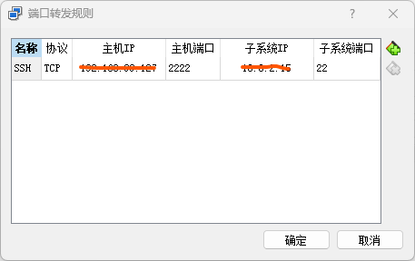
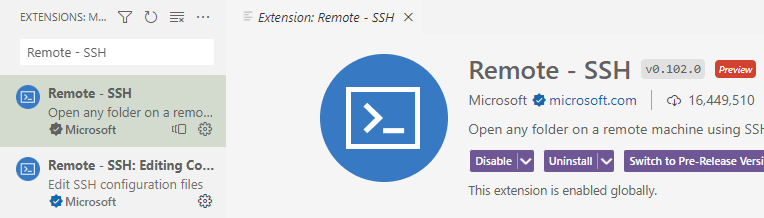
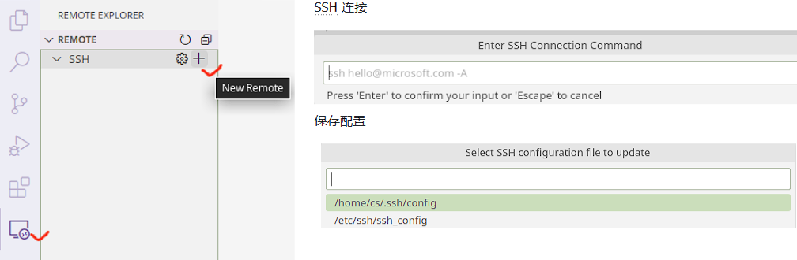

# Ubuntu 虚拟机安装及配置

## 本节目标

本节带大家使用 VirtualBox 安装一个 Ubuntu 22.04 LTS 桌面系统，并尝试使用 OpenSSH 模拟远程登陆。完成本节内容的学习，你应该能够尝试解决以下问题：

- 如何通过 VirtualBox 安装 Ubuntu 虚拟机？
- 如何使用 `apt` 包管理器安装、更新、删除软件包？
- 如何修改 Ubuntu 软件源提高下载速度？
- 如何使用 MSYS2 的 `ssh` 工具访问 Ubuntu 虚拟机？

## 安装 Ubuntu 虚拟机

[VirtualBox​​](https://www.virtualbox.org/) 是 Oracle 提供的一款流行的虚拟化软件，可用于 Linux、mac 和 Windows 系统。由于 Linux 系统相对灵活，软件包依赖维护较差，在不熟悉的情况下，很容易造成系统破坏，无法开机等问题。所以，初学阶段没必要在物理机上安装真实的 Linux 系统，就目前的学习而言，虚拟机提供的功能完全够用。一旦虚拟机出现问题，可以直接删除，重新安装。

提前下载 VirtualBox 和 Ubuntu 22.04 LTS 镜像：

- [点击下载 VirtualBox](https://download.virtualbox.org/virtualbox/7.0.10/VirtualBox-7.0.10-158379-Win.exe)
- [点击下载 Ubuntu 22.04 LTS](https://mirrors.aliyun.com/ubuntu-releases/22.04/ubuntu-22.04.3-desktop-amd64.iso)

详细的安装过程，请跟随课堂视频一步步完成安装。

## 安装开发工具

`apt` 命令是一个功能强大的命令行工具，它与 Ubuntu 的高级打包工具（APT）配合使用。 `apt` 中包含的命令提供了安装新软件包、升级现有软件包、更新软件包列表索引、甚至升级整个 Ubuntu 系统的方法。

尝试安装以下软件：

- `build-essential` 包含了常用的 `gcc` 开发工具

    ```
    sudo apt install build-essential
    ```

- 安装 `gdb`、`valgrind` 调试器和内存检测工具

    ```
    sudo apt install gdb valgrind
    ```

- 安装 `git`，`cmake` 等常用工具

    ```
    sudo apt install git cmake ninja-build
    ```

**_参考文献_**：

- [Package management](https://ubuntu.com/server/docs/package-management)

## 安装 SSH 工具

OpenSSH 是一个功能强大的工具集，用于远程控制联网计算机以及在联网计算机之间传输数据。OpenSSH 客户端和服务器应用程序的安装非常简单。

使用以下命令在 Ubuntu 系统上安装 OpenSSH 客户端应用程序：

```
sudo apt install openssh-client
```

使用以下命令在 Ubuntu 系统上安装 OpenSSH 服务器应用程序：

```
sudo apt install openssh-server
```

默认情况下，OpenSSH 服务将会自动启动，也可以使用下述命令手动开启服务：

```
sudo systemctl start sshd.service
```

**_参考文献_**：

- [OpenSSH Server](https://ubuntu.com/server/docs/service-openssh)

## 模拟远程登陆

这里需要先配置端口转发，详细的配置过程，请跟随课堂视频一步步完成。



完成端口转发配置后，我们可以使用终端模拟远程登陆：

```
$ ssh cs@localhost -p 2222
The authenticity of host '[localhost]:2222 ([127.0.0.1]:2222)' can't be established.
ED25519 key fingerprint is SHA256:gfHLfANKNM4cCAoDEZ/CiZ97ql3lfUA2CVM28H6JssM.
This key is not known by any other names.
Are you sure you want to continue connecting (yes/no/[fingerprint])? yes
Warning: Permanently added '[localhost]:2222' (ED25519) to the list of known hosts.
cs@localhost's password:
Welcome to Ubuntu 22.04.3 LTS (GNU/Linux 6.2.0-26-generic x86_64)

 * Documentation:  https://help.ubuntu.com
 * Management:     https://landscape.canonical.com
 * Support:        https://ubuntu.com/advantage

Last login: Tue Aug 15 13:56:00 2023 from 10.0.2.2
```

## VS Code 官方远程插件工作流

前往官网下载安装 [VS Code](https://code.visualstudio.com/)，在插件市场搜索并安装 **Remote - SSH** 插件。



插件安装完成后，在工具栏选择 Remote Explorer 模块，点击 SSH 后面的 **`+`** 号。在弹出的输入窗口中，输入 SSH 登陆地址。

```
ssh cs@localhost -p 2222
```

随后会提示选择配置文件保存位置，此处直接“回车”选择默认位置即可。



此时点击 Remote 右侧的刷新按钮，就可以看到服务器 IP。连接该服务器，只需要点击 IP 右侧的箭头，随后输入你的账户密码就可以登录。登录成功后，可以在 VS Code 右下角看到连接状态。


服务器连接成功后，通过 VS Code 菜单栏 **File** 可以选择 “**Open File/Open Folder**” 编辑你的文件或项目。
