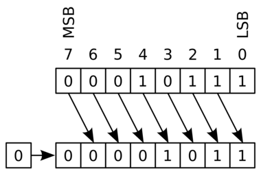
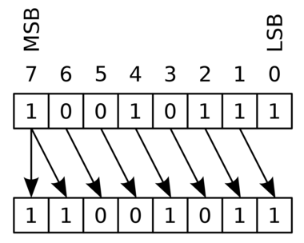

# 位运算

<div class="toc"></div>

到目前为止，我们已经知道数据在计算机内部是以二进制形式存储的。那么，我们如何操作二进制形式的数据呢？

## 布尔位运算

在 C 语言中，一个很有用的特性是可以按位进行布尔运算，对应的操作符是：`|`（OR），`&`（AND），`~`（NOT），`^`（XOR）。

- OR 的任意一个操作数为真（1），结果就为真（1）；AND 的任意一个操作数为假（0），结果就为假（0）；XOR 的两个操作数不同时，结果为真（1）
  
  ```c
  output = a | b;
  output = a & b;
  output = a ^ b;
  ```

- NOT 的操作数为真（1）时，结果就为假（0）；反之，操作数为假（0）时，结果就为真（1）

  ```c
  output = ~a;
  ```

> **辨析** 逻辑运算
>
> 在 C 语言中，逻辑运算（`||`，`&&`，`!`）很容易和位运算混淆。逻辑运算认为`非 0` 为 `true`，`0` 为 `false`。
>
> 逻辑运算是按整体数值来计算结果的，并不是在位级别上进行操作；这是区别于位运算最大的地方。

## 移位运算

移位运算也可以称为一种位运算，因为该操作符将值当作一系列的位来对待，而不是一个整体数值。但由于寄存器的位数固定，所以在移位过程中，总会有一些位被移出（shifted out）寄存器，也会有一些位被移进（shifted in）寄存器。

```c
x << k;   // 该表达式等于将 x 向左移动 k 个位后的值（x 不变）
x >>= k;  // 将 x 向右移动 k 个位（x 改变）
```

> **补充** `k` 的范围
> 
> 如果 x 是一个 int 整型，则 x 将由 32 个位组成。如果执行下面的操作：
>
> - `x << 32;`
> - `x >> 36;`
> - `x << 40;`
> 
> 参考书介绍说，这样的情况会先计算 `k` 和位数的模，再按模量来移动，上述语句最终移动的位数将变为 0、4 和 8 位。
> 
> 在 C 语言中，`k` 为负值或大于等于数据类型宽度是**未定义行为**（Undefined Behavior），上述语句并不会真正工作。

左移操作：将二进制位模式向左移动指定数量的位置。移动之后，低位（lower order）增加的部分用 0 补充，高位多余的部分将会丢失。

```c
00110111 << 2 // 11011100
01100011 << 4 // 00110000
10010101 << 4 // 01010000
```

右移操作：将二进制位模式向右移动指定数量的位置。移动之后，低位多余的部分将会丢失，但是高位（higher order）并不会默认补充 0。

- 对于**无符号整型**，高位补充 0，这种右移操作称为**逻辑右移**（Logical Right Shift）

  ```c
  unsigned short ux = 16;
  unsigned short uy = x >> 4;
  // 0000 0000 0001 0000 -> 0000 0000 0000 0001
  ```

  

- 对于**有符号整型**，高位补充符号位，这种右移操作称为**算术右移**（Arithmetic Right Shift）。
  
  虽然 C 标准并没有规定有符号整型必须采用算术右移，但是大部分编译器都默认这个行为，所以我们可以把这个行为当作事实来对待。

  ```c
  short x = 16;
  short y = x >> 4;
  // 0000 0000 0001 0000 -> 0000 0000 0000 0001
  
  x = -16;
  y = x >> 4;
  // 1111 1111 1111 0000 -> 1111 1111 1111 1111
  ```

  


> **陷阱** 注意操作符的优先级
> 
> 由于加法操作符优先级比移位运算符高，所以表达式 `1<<2 + 3<<4` 在 C 语言中的解释是 `1 << (2+3) << 4`。
> 
> 为了避免不必要的麻烦，尽量多加一些括号，比如这样 `(1<<2) + (3<<4)`。
