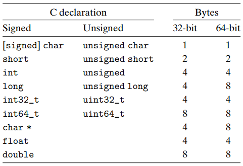

# 整型转换

<div class="toc"></div>

> **补充** `printf` 输出有符号/无符号整型不同形式
> 
> 查询 `man 3 printf` 可以了解一些其他的输出占位符，针对整型输出形式有如下一些补充。
> 
> - `%d` - 有符号整型按十进制形式输出
> - `%u` - 无符号整型按十进制形式输出
> - `%x` - 无符号整型按十六进制形式输出

## 转换 Casting

当发生类型转换的时候，字节层面的位模式会发生什么呢？答案是**位模式并不会作任何变化**。这也就意味着根据类型的不同，同样的位模式将被解释为不同的数值。

对于下述代码，当我们执行后输出结果是：`v = -12345`, `uv = 4294954951`

```C
int value = -12345;
unsigned uvalue = value;

printf("v = %d, uv = %u\n", value, uvalue);
```

有符号整型 `-12345` 的位模式表示是 `0b11111111111111111100111111000111`，当以无符号整型解释时，这将是一个很大的正数。

再次回顾上节课介绍的数字轮盘，同样的位模式在不同的数据类型下表达的数值是不同的。

上述代码从有符号整型转向无符号整型，可以在赋值过程中自动完成，我们称之为**隐式类型转换**。在 C 语言中，我们还可以使用 `(typename)value` 的语法，强制进行类型转换。

```c
unsigned uvalue2 = 4294954951U;
int value2 = uvalue2;
printf("value2 = %d, uvalue2 = %u\n", value2, uvalue2);
```

也可以在整型字面量后面加 U 后缀，表明该字面量为无符号整型。

```c
-12345U
```

当对有符号整型和无符号整型进行比较时，C 语言会将有符号整型**升级**（promote）为无符号整型，然后再执行比较操作。

> 相同字长的有符号和无符号数之间的转换规则：数值可能会变，但是位模式保持不变。

## 扩展 Expanding

另一种常见运算是在不同字长的整数之间进行转换，比如从 `short` 转为 `int`，或从 `int` 转为 `long`。



一个常见的运算是在不同字长的整数之间转换，又要保持数值不变。一般来说，从较大的数据类型转向较小的数据类型不太可能；反之，从较小的数据类型转向较大的数据类型比较容易做到。

- **零扩展**（Zero Extension）：将一个无符号整型提升到较大字长的无符号整型时，只需要简单地在开头补充 0，这种运算被称为零扩展。

    ```c
    unsigned short us = 4;  //                     0000 0000 0000 0100
    unsigned int ui = us;   // 0000 0000 0000 0000 0000 0000 0000 0100
    ```

- **符号扩展**（Sign Extension）：将一个有符号整型提升到较大字长的有符号整型时，则需要在开头补充最高有效位的值（0 或 1），这种运算被称为符号扩展。

    ```c
    short s = 4;  //                     0000 0000 0000 0100
    int i = s;    // 0000 0000 0000 0000 0000 0000 0000 0100

    short s = -4; //                     1111 1111 1111 1100
    int i = s;    // 1111 1111 1111 1111 1111 1111 1111 1100
    ```

> 对不同字长大小的数据类型作比较操作（`<、>、<=、>=`），会将较小字长的数据**升级**（promote）到较大字长，然后再进行比较。升级规则根据不同数据类型，有零扩展和符号扩展两种。

## 截断 Truncating

上节提到从较大的数据类型转向较小的数据类型不太可能保持数值不变。那么，有的时候我们确实需要作这样的转换，那么会发生什么情况呢？

在 C 语言中，这样的转换非常简单粗暴，当从较长字长的数据类型转向较小字长时，多余的字节将会直接忽略。这样的运算过程我们称之为**截断**（Truncating）。

- 无符号整型

    ```c
    unsigned int uv = 128000;
    unsigned short us = uv;
    unsigned int uv2 = us;
    // uv = 128000 | 00 f4 01 00
    // us = 62464  | 00 f4
    // uv2 = 62464 | 00 f4 00 00
    ```
- 有符号整型

    ```c
    int x = 53191;
    short sx = x;
    int y = sx;
    // x = 53191   | c7 cf 00 00
    // sx = -12345 | c7 cf
    // y = -12345  | c7 cf ff ff

    int x = -54321;
    short sx = x;
    int y = sx;
    // x = -54321  | cf 2b ff ff
    // sx = 11215  | cf 2b
    // y = 11215   | cf 2b 00 00
    ```

> 扩展数据类型不会造成数值变化，截断一般会改变原来的数值（仅较小的数可以保持数值不变）。

>**补充** `sizeof` 计算类型的字节数
>
> `sizeof` 可以将数据类型或表达式作为参数，并返回该类型或表达式类型的字节数。
> 
> 语法：`sizeof( type )` 或 `sizeof expression`
> 
> 参考：[sizeof operator](https://en.cppreference.com/w/c/language/sizeof)
