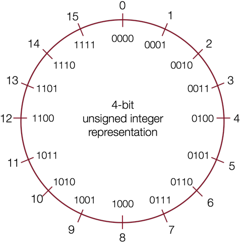

# 无符号整型

无符号整型只能表示 0 和正数，不可以表示负数。

无符号整型的二进制表示可以直接隐射到十进制数，例如：

$$0b0001 = 0 * 2^3 + 0 * 2^2 + 0 * 2^1 + 1 * 2^0 = 0 + 0 + 0 + 1 = 1 $$
$$0b0101 = 0 * 2^3 + 1 * 2^2 + 0 * 2^1 + 1 * 2^0 = 0 + 4 + 0 + 1 = 5 $$
$$0b1011 = 1 * 2^3 + 0 * 2^2 + 1 * 2^1 + 1 * 2^0 = 8 + 0 + 2 + 1 = 11$$ 
$$0b1111 = 1 * 2^3 + 1 * 2^2 + 1 * 2^1 + 1 * 2^0 = 8 + 4 + 2 + 1 = 15$$

如果用 \\(w\\) 表示位的个数，那么无符号整型能够表示的范围是 \\(0\\) 到 \\(2^{w}-1\\)，所以 C 语言中 int 能够表示的数字范围是 \\(0\\) 到 \\(4,294,967,295\\)。

下图通过数字轮盘形象地表示了无符号整型的二进制表示和十进制数字之间的关系，以及无符号整型能够表示的数字范围：

