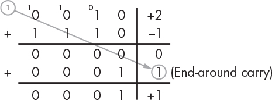
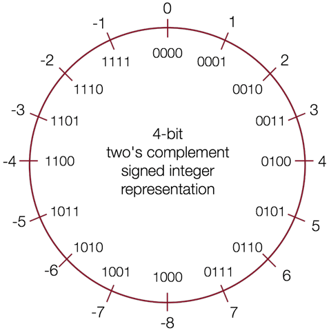

# 有符号整型

有符号整型可以表示 0，正数和负数。

既然要表示负数，那么首先需要解决的问题是：如何通过二进制位表示正或负？

目前的解决方案是通过保留一个符号位（最高位）来区分正和负，这个位称为**最高有效位** MSB（most significant bit）。

## 1s 的补码（ones' complement ）

通过将正数的所有二进制位进行反转来表示对应的负数，我们可以得到 1s 的补码表示。

这个命名的由来是基于这样的一个事实，对应的正负数相加可以得到全为 1 的二进制位。例如 -1 和 1 相加的二进制位是 1111。

1s 的补码的缺点是有两个用于表示 0 的不同位模式，造成了不必要的浪费。另外，在进行加法操作时，如果进位超过了总体位数，则需要进行循环进位（end-around carry）。例如，



目前，1s 的补码表示在数字信号处理领域依然有大量的应用。

## 2s 的补码（two's complement ）

如果我们想避免循环进位，可以对反转后的位额外进行一次加 1 操作，那么我们就得到了 2s 的补码表示。

例如，+1 二进制表示为 0001，反转后的结果是 1110，然后再进行加 1 操作得到 1111 用于表示 -1；同样，+2 二进制表示为 0010，反转后的结果是 1101，然后再进行加 1 操作得到 1110 用于表示 -2。

下图通过数字轮盘形象地表示了 2s 的补码表示的有符号整型的二进制表示和十进制数字之间的关系，以及有符号整型能够表示的数字范围：



2s 的补码表示是基数补码（Radix Complement）的一个应用。2s 的补码定义可以表述为一个 N 位表示的值的补码，是该值相对于 \\(2^N\\) 的补码。

名称中的 2 可以理解为 \\(2^N\\)，例如 4 个位表示的数字系统，\\(2^N = 16 = 10000\\)，那么 +5 的补码就是 -5 ，因为 0101(+5) + 1011(-5) = 10000；这样的结果对于其他互补的值同样成立。

2s 的补码表示除了看起复杂，但却有很多优点。

- 对应的正负数相加的结果依然是 0。

    ```
      0101 (+5)         1111  (-1)
    + 1011 (-5)       + 0001  (+1)
      ======            ======
      0000 (0)          0000  (0)
    ```

- 只有一个位模式用于表示 0，避免了浪费。
- 最高有效位 MSB 依然可以用于表示正负号。
- 加法操作逻辑更简单，可以用于任意的正负数组合，不需要循环进位。

    ```
      0010 (+2)         0100  (+4)           0100  (+4)
    + 1011 (-5)       - 0101  (+5)  -->>   + 1011  (-5)
      ======            ======               ======
      1101 (-3)         ????  (??)           1111  (-1)
    ```

> **🔔 小技巧** 对于二进制表示的数字，如何快速找到其对应的正/负值？
> 
> 从右向左，找到第一个 1，将左侧剩下的位全部反转即可。
> 例如，+2 的位模式为 00<span style="color:red">1</span>0，那么将第一个 1 左侧所有位反转可以得到 <span style="color:blue">11</span><span style="color:red">1</span>0，即为 -2。
