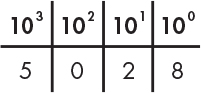
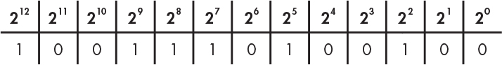

# 二进制 Binary

日常生活中，我们使用十进制数字系统，可能的原因是我们有十个手指，但是十进制与其他数字系统相比并没有什么不同。

计算机由于硬件的特性，经过历史的选择，最终保留了二进制数字系统。二进制数字系统是我们能够得到的最简单的数字系统——只有两个数字 0 和 1。

**位**（bit）是由英文 “binary digit” 简写而来，用于表示一个二进制数字位。这是组成信息块的最基本单位。位的概念可以理解为 1 或 0、开或关、是或否、真或假的值。

下图分别展示了十进制和二进制数字系统的计算原理。

$$5028 = 5 * 10^3 + 0 * 10^2 + 2 * 10^1 + 8 * 10^0$$

$$5028 = 1 * 2^{12} + 1 * 2^9 + 1 * 2^8 + 1 * 2^7 + 1 * 2^5 + 1 * 2^2$$

**字节**（byte）是由 8 个位组成。由于计算机内存是一个由地址编号的大号字节数组，通过地址可以访问每一个字节，所以在计算机编程中，我们无法直接访问某个位。字节是我们能够处理的最小单位。

根据上述计算原理，我们可以得出一个字节可以表示的数字范围是 \\([0, 255]\\)。

> **🔔 小技巧** 基于基数（Base）的乘法和除法
>
> - 乘法需要向右移动 1 位并补零：1450 * 10 = 14500 对比 1100 * 2 = 11000
> - 除法只需要向左移动 1 位：1450 / 10 = 145 对比 1100 / 2 = 110

## 开心一刻

基于**多项式展开原理**设计的小游戏：[Guess Number](./assets/guess_number.svg)
