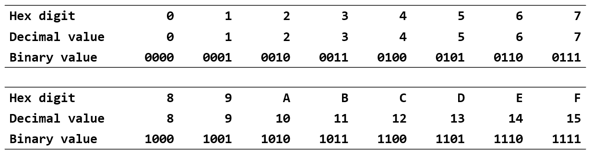

# 十六进制 Hexadecimal

**十六进制**（hexadecimal）是使用 16 个不同的符号表示的数字系统，“0”-“9”表示值 0 到 9，“A”-“F”（或小写）表示 10 到 15 之间的值。

由于二进制数字阅读比较困难，在软件开发中，我们一般使用十六进制数字系统，因为它们提供了更人性化的表示。每个十六进制数字代表四个位，也称为**半字节**（nibble）。例如，一个字节的值范围从 `00000000` 到 `11111111` 的二进制形式，可以方便地表示为十六进制的 `00` 到 `FF`。

为了便于区分，在 C 语言中二进制使用 `0b` 前缀，十六进制使用 `0x` 前缀。例如，`0xf5` 可以表示为 `0b11110101`。

由于十六进制和二进制的对应关系，两者之间很容易进行转换，本课程要求大家能够通过记忆一些规律进行快速转换。

一张表比较下三种进制之间的优劣：

| 进制     | 表示形式     | 优点                                       | 缺点             |
| -------- | ------------ | ------------------------------------------ | ---------------- |
| 十进制   | `165`        | 可读性强                                   | 不好对应到比特位 |
| 二进制   | `0b10100101` | 清晰地表示计算机位模式                     | 可读性差         |
| 十六进制 | `0xa5`       | 既便于转换到二进制位模式，又便于书写和阅读 |
