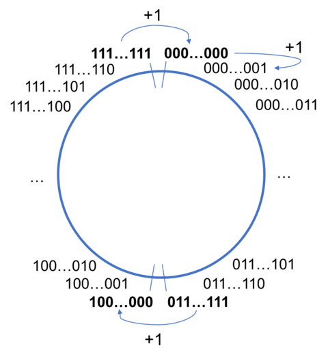

# 整型溢出

溢出意味着不连续。

所谓“整型溢出”，就是这样一种现象，即

- 最大的位模式表示 `0b1111` 加一个较小的数值时，比如 `0b1` 或 `0b10`，每个位都需要作进位操作。对于有限的位，这将造成最后的一次进位丢失，无法表示出来，最终变为较小的位模式。
- 最小的位模式表示 `0b0000` 减一个较小的数值时，比如 `0b1` 或 `0b10`，每个位都需要作借位操作。同样对于有限的位，最后一次借位不会表示出来，最终结果会变为较大的位模式。

根据之前介绍的数字轮盘，我们可以知道，

- 对于有符号整型，溢出发生在轮盘的下方
- 对于无符号整型，溢出发生在轮盘的上方

C/C++ 常见的数据类型可以表示的数值范围，可以通过导入头文件 `#include <limits.h>` 来查看，参考 [Numeric limits](https://en.cppreference.com/w/c/types/limits)。

- `INT_MIN`
- `INT_MAX`
- `UINT_MAX`
- `LONG_MIN`
- `LONG_MAX`
- ……

对于这些类型的使用，要特别注意溢出的问题。
