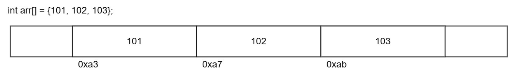
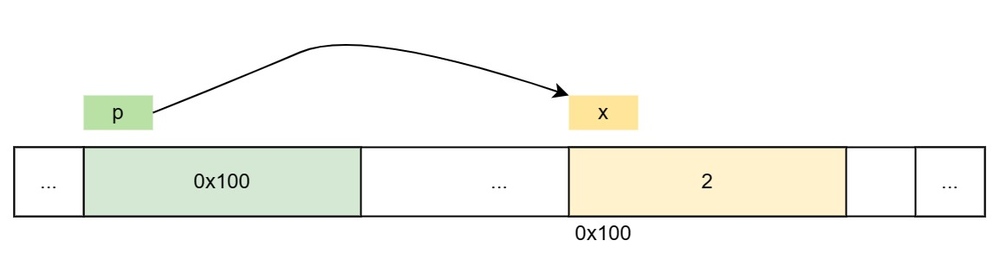

# 数组和指针

<div class="toc"></div>

深入理解系统的工作原理，我们需要从内存角度重新理解数组和指针的行为。通过 CS101 的训练，我们对数组和指针的一些现有知识进行一些总结。

## 数组

计算机除了可以表示基本的数值型数据，还可以根据基本的数据创建出更复杂的数据类型。和其他编程语言一样，C 也提供了一些定义新数据类型的方法，本章我们先来研究**数组**相关的技术。

数组是一系列元素的集合，按顺序存储并且元素类型必须相同。

- 数组是有序的
- 数组是同质的


声明一个数组时，系统会在内存上分配一个连续的空间用于存储数组的内容。数组可以通过指定数组的名字和对应元素的下标来指定某个特定元素，其表达式形如：`array-name[index]`。

```c
int arr[6];
arr[0] = 1;
arr[1] = 2;
// ...
arr[5] = 6;

int arr[] = {1, 2, 3, 4, 5, 6};
```

数组变量包含三个重要信息：
- 数据宽度：`char` 表明每个元素占用 1 个字节；`int` 表明每个元素占用 4 个字节。
    ```c
    sizeof(arr[0])   // 4
    ```
- 首元素地址：数组变量名记录了数组首元素的地址。通过赋值给指针，我们可以将数组首元素地址保存到指针中。
    ```c
    int* ptr = arr;  // e.g. 0x7ffeb4864620
    ```
- 数组长度：数组还包含的元素个数，可以通过 `sizeof` 计算。
    ```c
    sizeof(arr) / sizeof(arr[0])  // 6
    ```



> **辨析** `sizeof` 不是函数
>
> C 提供了一个编译时（compile-time）一元运算符 `sizeof`，可以用于计算任何对象的大小。表达式为：
>
> `sizeof object` 或 `sizeof(object)`
>
> 该表达式（不是函数调用）生成一个整型值，用于指示某个指定对象或类型的字节数。严格来说，该整型值是一个类型为 `size_t` 的无符号整型，定义在 `<stddef.h>` 头文件中。
>
> 这里的对象可以是变量名、数组名或结构体名；类型可以是基本类型（`int`、`double`），也可以是复合类型（结构体、指针）。
> 
> 数组的大小就是单个元素的大小乘以数组的个数，所以数组的个数可以使用 `sizeof(arr) / sizeof(arr[0])` 来计算。
>
> *参见《K&R C 6.3 Arrays of Structures》*

## 指针

内存可以看作是一个“大号数组”，以字节为单位，每一个字节都有一个独特的地址编号，常用十六进制表示。

在 C 语言中，使用指针特殊数据类型来抽象内存的地址。通过指针，我们才可以进行内存相关的操作。

指针变量用于存储内存的地址，指针本身占用一个**字**（word）的内存空间。对于任意大小的数据，都可以使用指针表示其内存地址。

- 声明一个指针可以使用 `type* varName` 语法

    声明指针意味着该指针变量中可以存放某个类型的内存地址。
- 获取变量的地址可以使用取址 `&` 操作符

    例如，`&x` 可以读作获取变量 `x` 的地址。
- 获取指针指向的地址内的数据可以使用间接引用 `*` 操作符

    例如，`*p` 可以读作获取指针 `p` 指向的内存 `0x100` 中的数据。

    ```c
    int x = 2;
    int* p = &x;
    printf("%d\n", *p);  // 打印 2 (x 内存中的值)
    printf("%p\n", p);   // 打印 0x100 (x 内存地址)
    ```

    

### 空指针 NULL

初始化一个指针，如果暂时不指向任何数据，可以使用特殊常量 `NULL`。该常量可以赋值给任何类型的指针，在系统内部表示地址值 `0`。

需要注意的是，一旦指针的值为 `NULL`，那么就不要使用 `*` 操作符来间接引用该指针。

```c
int* ptr = NULL;
int i = *ptr;  // ERROR
```
