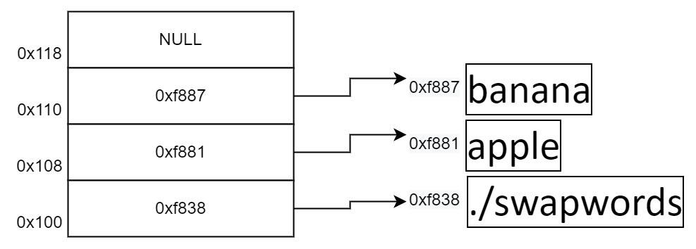

# 多维数组和二级指针

<div class="toc"></div>

数组的元素类型可以是任意的，特别的是，数组的元素也可以是数组。这种数组的数组称为**多维数组**。

声明并初始化多维数组可以这么写：

```c
char stringArr[3][4] = {"cat", "dog", "rat"};
int matric[3][3] = {
    {1, 2, 3},
    {4, 5, 6},
    {7, 8, 9}
};

printf("%s\n", stringArr[0]);  // "cat"
printf("%d\n", matric[0][1]);  //  2
```

注意，数组 `stringArr` 的第二维大小为 4，足够存放字符串的结尾字符。

> 思考：如果将 4 改成 3 会发生什么情况呢？

## 指针数组/二级指针

由于字符串大小比较灵活，上述声明方式不便于组织不同大小的字符串。为了解决这个问题，我们可以声明一个指针数组，即数组的元素类型为指针，再通过指针指向字符串的位置。

```c
char* stringArray[5]; // 存储 5 个 char* 指针
```

回顾 `main` 函数参数 `char* argv[]`，当执行 `./swapwords apple banana` 时，`argv` 内存布局类似下图所示：



由于数组参数会退化为指针，所以 `char* argv[]` 在函数内会变为 `char** argv`。
