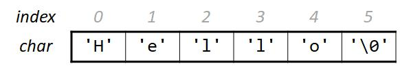

# 字符串

在 C 语言中，没有专门的字符串数据类型。字符串通过字符数组间接表示。例如，字符串 `"Hello"` 使用字符数组表示如下：



特别的，字符串以特殊标记字符 `'\0'` 结尾，位模式是一个全零的字节。`'\0'` 称作 **null-terminating** 字符，也记作 `NUL`。注意区别空指针 `NULL`，这是两个不同的东西。

> 回想 Lab 1 挑战部分的全零字节检测，合法的字符串都会以一个全零字节结尾。

以数组的观点来看待字符串，我们可以参照数组，使用 `char[]` 来声明字符串。在分配字符串数组的时候，一定记得多分配一个字符空间用于存储终止字符。

```c
char myString[6];
myString[0] = 'H';
myString[1] = 'e';
myString[2] = 'l';
// …
myString[5] = '\0'; // don't forget it!!!

// or
char myString[] = {
    'H',
    'e',
    'l',
    'l',
    'o'
};
```

访问或者修改字符串中的某个字符，可以通过字符数组下标；通过数组名，也可以访问整个字符串，C 语言检测到终止字符会自动判断字符串结尾。

```c
printf("%c\n", myString[2]); // 'l'
myString[1] = 'a';
printf("%s\n", myString);    // "Hallo"
```

> [示例代码](https://godbolt.org/z/95adaePzK)
