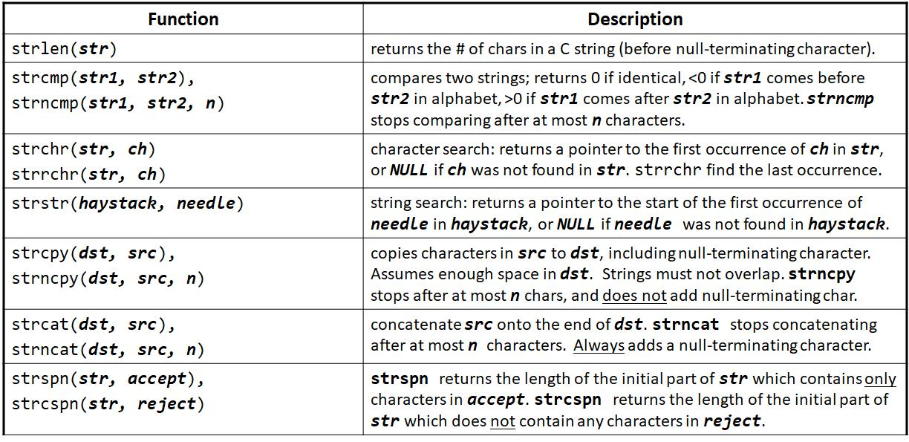
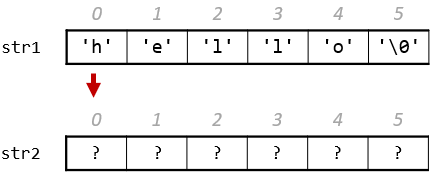
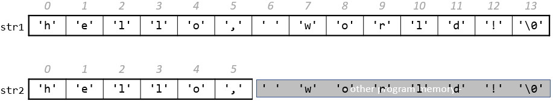
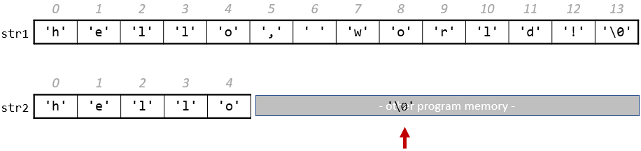
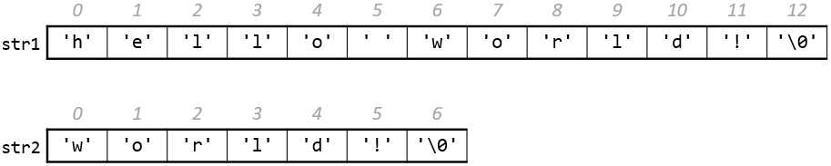

# string.h

<div class="toc"></div>

> 本小节将以数组的观点来看待字符串！

标准库 `string.h` 提供了大量的字符串操作函数，但是这些函数大多不会作条件检查，所以输入参数必须是合法的字符串，在必要时也可以加一些条件判断。更多信息可以参考[在线文档](https://en.cppreference.com/w/c/string/byte)。



## 长度 strlen

和 C++ 中 `std::string` 不同的是，C 语言的字符串不是对象，不包含字符串相关的信息（例如字符串的长度）。

如果想计算一个字符串的长度，我们可以使用 `strlen` 标准函数，结尾终止字符不会统计在内。对于 "Hello" 字符串，计算结果如下：

```c
#include <string.h>

char myString[] = {'H', 'e', 'l', 'l', 'o'}; 
int length = strlen(myString); // 5
```

> **辨析** 数组长度 vs 字符串长度
>
> `sizeof` 除了可以计算数据类型的长度，还可以用于计算数组的大小，语法类似于 `sizeof(arr)/sizeof(arr[0])`。
>
> 由于字符串会添加空白终止字符到末尾，所以不可以使用该语法替代 `strlen`。

注意 `strlen` 必须要遍历整个数组，所以其复杂度为 `O(N)`。

> [示例代码](https://godbolt.org/z/nMr686cf6)

## 比较 strcmp

比较操作符，比如 `==`，`<` 或 `>` 等，无法比较字符串。下面的写法，实际上是在比较字符串首字符的地址。

```c
// e.g. str1 = 0x7f42, str2 = 0x654d
void doSomething(char str1[], char str2[]) {  
    if (str1 > str2) { // compares 0x7f42 > 0x654d!
        // …
    }
}
```

比较两个字符串可以使用 `strcmp(str1, str2)`，该函数会依次比较字符数组中的每个字符，并返回一个整型。

- 两个字符串相等时，返回 0
- `str1` 中的字符比 `str2` 中的字符靠前，返回负值
- `str1` 中的字符比 `str2` 中的字符靠后，返回正值

```c
#include <string.h>

int compResult = strcmp(str1, str2);

if (compResult == 0) {  
    // equal
} else if (compResult < 0) {
    // str1 comes before str2   
} else {  
    // str1 comes after str2
}
```

## 复制 strcpy

赋值操作 `=` 并不能将一个字符串复制给另一个字符串变量。下面的写法，实际上是复制的时字符串首字符的地址。

```c
// e.g. param1 = 0x7f42, param2 = 0x654d
void doSomething(char param1[], char param2[]) {  
    param1 = param2;   // copies 0x654d.  Points to same string!
    param2[0] = 'H';   // modifies the one original string!
}
```

复制整体字符串可以使用 `strcpy(dst, src)`。该函数会将 `src` 字符数组复制到 `dst` 字符数组中，包括 `'\0'` 终止字符。注意该函数是有返回值的，返回 `dst` 字符串。

```c
char str1[6];
strcpy(str1, "hello");

char str2[6];
strcpy(str2, str1);
str2[0] = 'c';

printf("%s", str1);    // hello
printf("%s", str2);    // cello
```

使用 `strcpy` 要特别注意，`dst` 数组大小一定不能小于 `src` 数组。如上所述，可以使用 `sizeof` 进行条件检查。

以下代码是可以正常复制的，数组的大小恰好可以容下字符串 `"hello"` 和一个终止符。

```c
char str1[6];
strcpy(str1, "hello");

char str2[6];
strcpy(str2, str1);
```



但是接下来的代码就会有问题，`str2` 无法容下 `"hello, world!"`，但是复制操作依然会进行，这样造成的后果是 `str2` 后面的字节将被覆盖。

```c
char str1[14];
strcpy(str1, "hello, world!"); // correct
char str2[6];  
strcpy(str2, str1);  // not enough space - overwrites other memory!
```



如果 `str2` 后面的字节被系统中其他程序使用，那么覆盖写入将会造成严重的安全问题。我们将这种越界写入问题，称作**缓冲区溢出**（buffer overflow）。

## 复制 strncpy

复制部分字符串可以使用 `strncpy(dst, src)`，与 `strcpy` 不同的是 `strncpy` 并不保证 `dst` 字符串以 `'\0'` 结尾。

```c
// copying "hello"
char str2[5];  
strncpy(str2, "hello, world!", 5);  // doesn't copy '\0'!
```

> **补充** 没有 `'\0'` 终止符的字符数组
>
> 如果字符数组没有 `'\0'` 终止符，那么系统就无法确定字符串的结尾。例如，使用 `strlen` 计算该字符数组的长度时，函数将一直读取该字符数组随后的字节，直到发现终止字符为止。

由于没有终止字符，在调用 `strlen` 时，会一直计算到随后的系统其他部分的 `'\0'` 处。

```c
char str2[5];  
strncpy(str2, "hello, world!", 5);  // doesn't copy '\0'!
int length = strlen(str2);  
```



同样，由于没有终止字符，`printf` 也会一直打印到有 `'\0'` 的地方，输出的结果可能就会包含乱码：`hello⍰⍰J⍰⍰⍰`。

## 拼接 strcat strncat

同样，拼接字符串也不能直接使用 `+` 操作符。下面的写法，实际上是相加两个字符串首字符的地址。

```c
// e.g. param1 = 0x7f, param2 = 0x65
void doSomething(char param1[], char param2[]) {  
    printf("%s", param1 + param2);  // adds 0x7f and 0x65!
    // ...
}
```

拼接两个字符串可以使用 `strcat(str1, str2)`，拼接指定的几个字符可以使用 `strncat(str1, str2)`。这两个函数在拼接过程中，会去除原始字符串的终止字符，并能够保证返回的结果字符串以 `'\0'` 结尾。

以下示例创建了两个字符串，其中 `str1` 所在字符数组留有足够空间用于拼接字符串 `str2`。

```c
char str1[13];  // enough space for strings + '\0' 
strcpy(str1, "hello ");
char str2[7];
strcpy(str2, "world!");

strcat(str1, str2);  // hello world!
```

函数 `strcat` 会去除 `str1` 中的终止字符，并紧随其后追加 `str2` 中的字符。



## 间距 strspn strcspn

`strspn` 计算字符串开头部分，只包含第二个参数中出现的字符的长度。

```c
char bailey[11];
strcpy(bailey, "Bailey Dog");
int spanLength = strspn(bailey, "aBeoi");       
printf("%d\n", spanLength); // 3

char bailey[11];
strcpy(bailey, "gailey Dog");
int spanLength = strspn(bailey, "aBeoi"); 
printf("%d\n", spanLength); // 0
```

`strcspn` 是 `strspn` 的互补函数，计算字符串开头部分，不包含第二个参数中出现的字符的长度。

```c
char bailey[11];
strcpy(bailey, "Bailey Dog");
int spanLength = strcspn(bailey, "aBeoi");       
printf("%d\n", spanLength); // 0

char bailey[11];
strcpy(bailey, "gailey Dog");
int spanLength = strcspn(bailey, "aBeoi"); 
printf("%d\n", spanLength); // 1
```

## 搜索 strchr strrchr strstr

`strchr` 搜索字符串中的字符，返回一个指向该字符的指针。

- 如果字符串中有多个相同的字符，则返回首个字符的指针；
- 如果字符串中没有该字符，则返回 `NULL`。

`strrchr` 区别于 `strchr`，如果字符串中有多个相同的字符，则返回最后一个字符的指针。

```c
char myString[6];
strcpy(myString, "Hello");
char* charL = strchr(myString, 'l');
char* charL2 = strrchr(myString, 'l');

printf("%c\n", myString);  // 'H'
printf("%c\n", charL);     // 'l'
printf("%c\n", charL2);    // 'l'
```

`strstr` 搜索字符串中的子字符串，并返回一个指向该字符串的指针。

- 如果字符串中有多个相同的子字符串，则返回首个子字符串的指针；
- 如果字符串中没有该子字符串，则返回 `NULL`。

```c
char bailey[11];
strcpy(bailey, "Bailey Dog");
char* substr = strstr(bailey, "Dog");
printf("%s\n", bailey);  // Bailey Dog
printf("%s\n", substr);  // Dog
```

> **思考** 此指针非彼指针
> 
> `strchr/strrchr` 和 `strstr` 都返回了一个 `char*`，但前者表示字符指针，后者却表示子字符串。系统是如何区分的？
