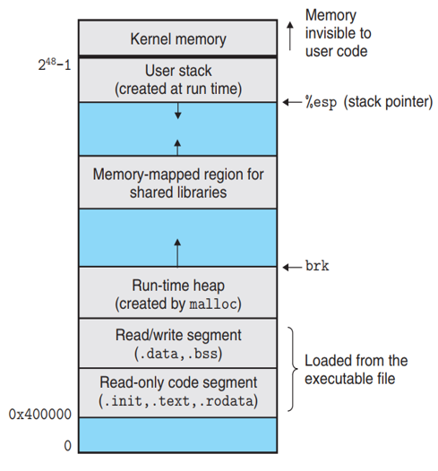

# 内存布局

本课程第三个话题是讨论如何在程序中管理各种不同的内存类型。理解这个问题可以帮助我们更好地理解以下几个问题：

- 如何使用指针高效地传递数据
- 介绍堆/栈的概念，掌握动态内存管理技术

## 程序的内存布局 Memory Layout

程序在执行时，操作系统会为其创建一个内存镜像（memory image），在程序的眼里，整块内存都为其所用。

生活中有这样的场景，当你拿出一张老唱片或一盒旧磁带准备播放音乐时，首先要打开播放器的卡槽，然后放入唱片或磁带。

计算机在执行某个可执行程序时，也有类似的动作。如下图所示，当执行程序时，操作系统会将我们写好的可执行程序文件，例如 `hello`，加载到地址 `0x400000` 的内存槽中，即代码段。这就很像我们插入 CD 的动作。
在 Linux x86-64 系统中，**代码段**的地址总是从地址 `0x400000` 处开始。

我们的播放器只能读取 CD 上的音乐信息，不能进行任何修改。如果播放器可以随意修改，那么下一次播放的时候，音乐可能已经消失。这将造成严重的数据丢失问题。

同理，我们写好的程序也应该不允许随意地修改。例如你写的 `main` 函数用于打印 `"hello world"`，如果下次打印出 `"hallo morld"`，这也将造成严重的安全问题。

所以，加载后的内存开头部分，系统规定为只读的，即 Read-only code segment。这个区域包含我们写好的函数指令（位于 `.text` 只读代码段）以及字符串的字面量（位于 `.rodata` 只读数据段）。

当然，我们的程序比 CD 要强大很多，除了只读数据段，再往后还有一段可以用于存放全局变量和静态变量，这个区域是可读可写的，即 Read/write segment。所以**数据段**分为只读、读写两个区域。

数据段之后就是**堆内存**，话题 3 将重点讨论。该区域是由程序员自行管理的，可以分配内存也可以释放内存。

堆内存后面的区域是**共享库保留区**。因为静态库会编译到我们的可执行文件中，这会造成程序文件增加，浪费硬盘空间，加载到内存区后，也会造成内存占用。所以对于一些 `printf` 这些标准库函数来说，映射到共享库区域是最佳的选择。

**用户栈**一般从最大合法用户地址处 \\(2^{48}-1\\) 开始，向较小的内存地址增长。而从 \\(2^{48}-1\\) 地址往上的区域，是为操作系统内核保留的。
